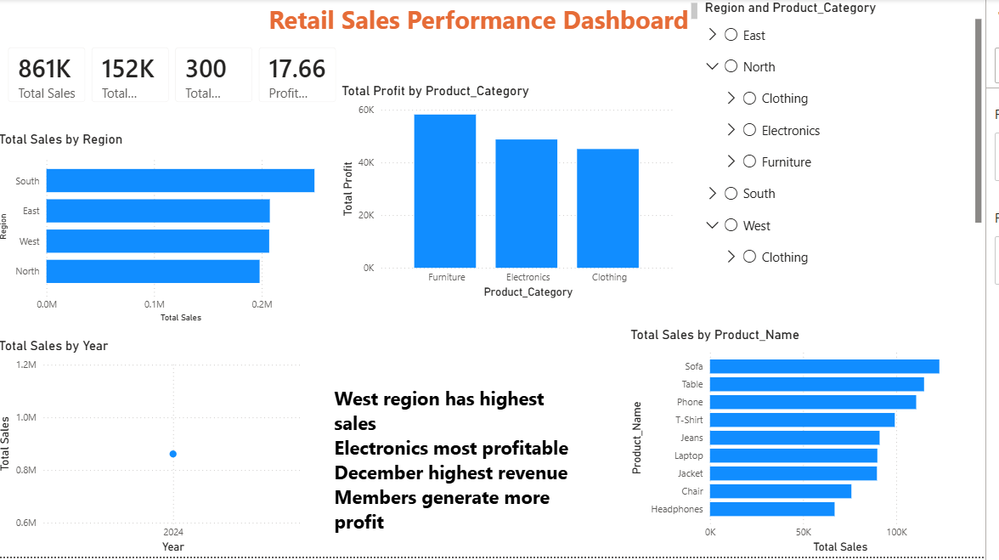

# 📊 Retail Sales Performance Dashboard

Interactive Power BI dashboard analyzing retail sales, profit, and product performance across regions and customer segments.

## 🔧 Tech Stack
- Excel  
- Power BI  
- DAX  
- Power Query  

## 📁 Files in Repository
- sales_dashboard.pbix → Power BI dashboard  
- sales_data.xlsx → dataset  
- retail_sales_dataset.xlsx → raw dataset  

## 📊 Dashboard Features
- KPI cards: Total Sales, Profit, Orders, Profit Margin  
- Sales by Region  
- Profit by Category  
- Monthly Sales Trend  
- Top Products by Sales  
- Interactive slicers (Region, Category, Customer Type)

## 📈 Key Insights
- West region has highest sales  
- Electronics most profitable  
- December highest revenue  
- Members generate more profit  

## 🖼 Dashboard Preview
(Add screenshot file named **dashboard.png.png** in repo)

## 🚀 How to Open
1. Download `sales_dashboard.pbix`
2. Open in Power BI Desktop
3. Interact with filters

## 👩‍💻 Author
Shruti Kolpyakwar  
